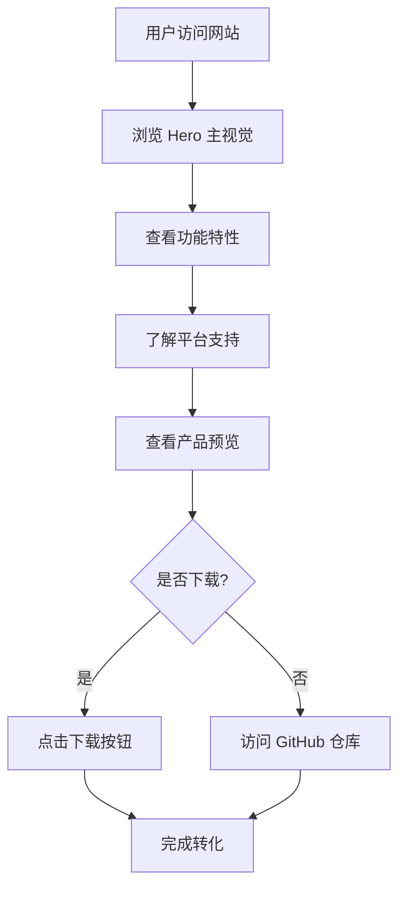

## 1. 产品概述

FadeMemo 是一款跨平台备忘录应用的宣传网站，用于向用户展示产品特色、功能亮点、多平台支持情况，并提供下载入口。
- 目标用户：需要高效记录和管理笔记的各类用户（学生、职场人士、创作者等）
- 核心价值：通过精致的视觉设计和清晰的信息架构，传达 FadeMemo "简约而不简单" 的产品理念，吸引用户下载体验

## 2. 核心功能

### 2.2 功能模块
1. **首页（单页滚动）**：Hero 主视觉区、功能特性区、平台支持区、产品预览区、行动召唤区

### 2.3 页面详情
| 页面名称 | 模块名称 | 功能描述 |
|-----------|-------------|---------------------|
| 首页 | Hero 主视觉区 | 品牌名称、核心标语、主视觉图、双 CTA 按钮（下载/了解更多） |
| 首页 | 功能特性区 | 6 个核心功能的图标卡片展示，支持 hover 动效 |
| 首页 | 平台支持区 | 展示 Web/iOS/Android/Windows/macOS/Linux 六大平台支持 |
| 首页 | 产品预览区 | 应用截图展示，带有视差滚动效果 |
| 首页 | 行动召唤区 | 最终下载入口、GitHub 链接、版权信息 |

## 3. 核心流程

用户访问网站 → 浏览 Hero 区了解产品定位 → 滚动查看功能特性 → 了解多平台支持 → 查看产品预览 → 点击下载按钮获取应用

## 4. 用户界面设计

### 4.1 设计风格
- **主色调**：深邃的墨蓝色 (#0f172a) 作为背景，搭配琥珀色 (#f59e0b) 作为强调色，营造专业且温暖的氛围
- **辅助色**：使用渐变（紫罗兰 #8b5cf6 → 琥珀 #f59e0b）作为点缀
- **按钮风格**：圆角矩形（8px），主按钮使用琥珀色填充，次按钮使用边框样式
- **字体**：标题使用 "Fraunces"（优雅衬线体），正文使用 "Manrope"（现代无衬线体）
- **布局风格**：单页滚动，大量留白，卡片式功能展示，左右交替布局
- **动效**：滚动渐入动画、hover 上浮、背景渐变流动、装饰元素视差

### 4.2 页面设计概览
| 页面名称 | 模块名称 | UI 元素 |
|-----------|-------------|-------------|
| 首页 | Hero 主视觉区 | 全屏高度，深色背景 + 渐变光晕，左侧文案 + 右侧装饰图形，淡入动画 |
| 首页 | 功能特性区 | 3x2 网格布局，卡片带图标 + 标题 + 描述，hover 上浮 + 边框高亮 |
| 首页 | 平台支持区 | 居中布局，6 个平台图标环绕排列，连线动画效果 |
| 首页 | 产品预览区 | 大尺寸截图展示，视差滚动，左右切换按钮 |
| 首页 | 行动召唤区 | 渐变背景，居中大按钮，底部链接列表 |

### 4.3 响应式设计
- 桌面优先（>= 1024px）：完整展示所有内容，多列布局
- 平板适配（768px - 1024px）：功能卡片调整为 2 列，Hero 区垂直布局
- 移动端适配（< 768px）：单列布局，简化动效，优化触控体验
