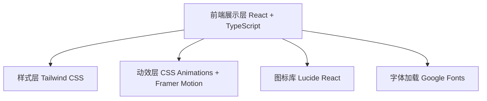

## 1. 架构设计



## 2. 技术说明
- **前端框架**：React@18 + TypeScript
- **构建工具**：Vite
- **样式方案**：Tailwind CSS@3
- **动效库**：Framer Motion（用于滚动动画和微交互）
- **图标库**：lucide-react
- **字体**：Google Fonts (Fraunces + Manrope)
- **后端**：无（纯静态展示页面）
- **数据库**：无

## 3. 路由定义
| 路由 | 用途 |
|-------|---------|
| / | 首页（单页滚动，包含所有内容区块） |

## 4. 项目结构
```
src/
├── components/
│   ├── Hero.tsx           # Hero 主视觉区
│   ├── Features.tsx       # 功能特性区
│   ├── Platforms.tsx      # 平台支持区
│   ├── Preview.tsx        # 产品预览区
│   ├── CallToAction.tsx   # 行动召唤区
│   └── Navbar.tsx         # 顶部导航栏
├── data/
│   └── content.ts         # 页面内容数据集中管理
├── App.tsx
├── main.tsx
└── index.css
```
